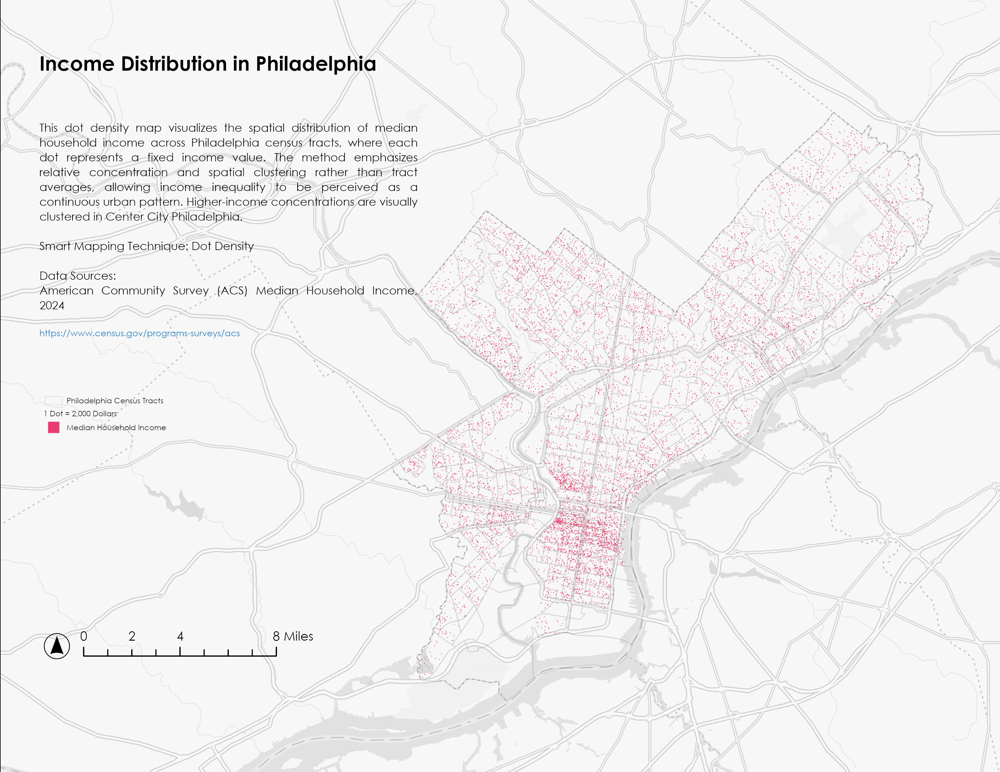
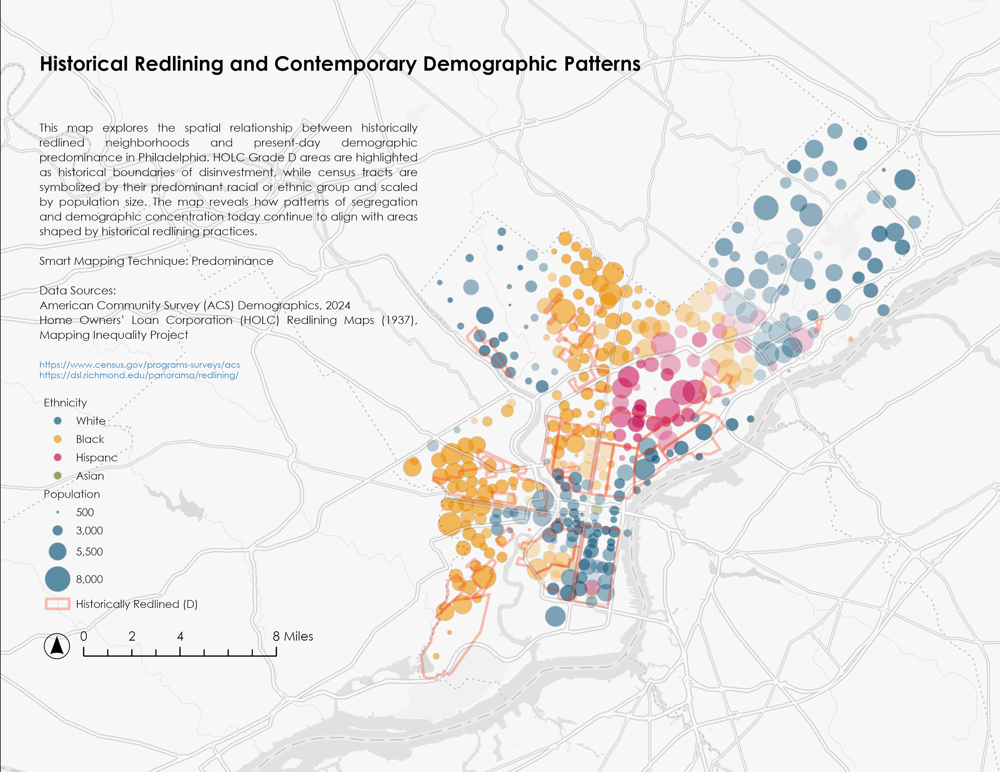
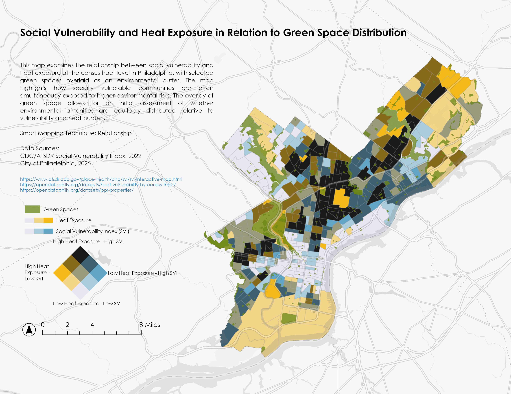

# Seeing Urban Heat Through Computer Vision
### Urban Morphology and the Ecology of Thermal Landscapes — Philadelphia

**→ [Open Interactive Dashboard](https://yumeng-zh.github.io/philly-urban-heat/demo/)**

---

## Overview

Urban heat exposure is shaped not only by horizontal land cover — which satellite remote sensing captures well — but also by the three-dimensional arrangement of buildings, vegetation, and sky that governs radiation exchange, evapotranspiration, and airflow at street level.

This project integrates Random Forest machine learning with semantic segmentation of Google Street View imagery to investigate what street-level spatial configurations contribute to thermal patterns that satellite-based models do not fully explain, using Philadelphia as a case study.

A companion study examining green infrastructure network connectivity as a further mechanism of urban heat mediation is in preparation separately.

---
## Context


*Median household income distribution across Philadelphia census 
tracts — higher-income concentrations cluster in Center City.*


*Historical HOLC redlining boundaries (Grade D) and contemporary 
demographic patterns, revealing persistent spatial inequities.*


*Social vulnerability index and heat exposure overlaid with green 
space distribution — socially vulnerable communities face 
simultaneous environmental burdens.*

---

## Approach

### Stage 1 — Machine Learning (Baseline + Anomaly Detection)

- Built a Random Forest model to predict land surface temperature at 100m resolution across Philadelphia (R² = 0.909, 5-fold spatial cross-validation)
- Identified thermal anomalies as locations where observed temperatures deviate substantially from model predictions
- These anomaly zones serve as entry points for further street-level spatial interpretation — treating model failure as evidence rather than noise

### Stage 2 — Street-Level Computer Vision

- Processed 300 Google Street View images across 75 sampled grids using SegFormer-B0 (ADE20K, 150 classes)
- Extracted seven morphological indicators per grid, averaged across four cardinal directions:
  - Green View Index (GVI), Sky View Factor (SVF), Building View Factor (BVF), Road View Factor (RVF)
  - Canyon ratio (BVF/SVF), Canopy Height Proxy, Vegetation–Sky ratio
- These indicators provide a street-level representation of vertical spatial structure absent from satellite-derived features

---

## Key Findings

Rather than optimizing predictive performance, this project focuses on interpreting residual patterns to uncover spatial mechanisms that overhead analysis cannot describe.

Three distinct cooling patterns were identified in anomalously cool zones:

- **Mature-canopy environments** — likely driven by evapotranspiration; high GVI with elevated canopy height proxy
- **Reconfigured urban corridors** — where recent landscape change shifts vegetation and sky exposure together
- **Street-canyon geometries** — where built form reduces radiative exposure despite minimal vegetation

Conversely, unexpectedly hot zones are consistently associated with high sky exposure and low vegetation — a configuration not well captured by 2D land-cover variables, and the primary blind spot identified in satellite-based thermal modeling.

Sky View Factor shows the strongest relationship to model residuals across sampled scenarios, suggesting that vertical sky exposure is a dimension of urban heat that overhead data systematically underrepresents.

---

## Interactive Dashboard

**→ [Open the live dashboard](https://yumeng-zh.github.io/philly-urban-heat/)**

Includes:
- Residual heat map with spatial anomaly detection and zone annotations
- ML model exploration, EDA, and feature correlation
- CV pipeline visualization: image → segmentation → morphological indicators
- Scenario-based street-section interpretations with energy flow annotations

---

## Repository Structure

```
├── code/
│   ├── download_street_view_images.py      # Google Street View batch downloader
│   ├── process_street_view_segmentation.py # SegFormer segmentation pipeline
│   └── integrate_cv_ml_results.py          # CV–ML integration and residual analysis
│
├── data/
│   ├── anomaly_sampling_points.csv         # 75 sampled grids (primary)
│   ├── sampling_supplement.csv             # 30 supplement grids
│   └── cv_results_grid_level.csv           # Grid-level CV indicators (7 features, 75 grids)
│
├── demo/
│   └── index.html                          # Full interactive dashboard (self-contained HTML)
│
└── figures/
    └── (static figures for manuscript)
```

---

## Reproduction

### Requirements

```bash
pip install transformers torch torchvision pillow numpy pandas scikit-learn requests
```

### Run the pipeline

```bash
# 1. Set your Google Maps API key in download_street_view_images.py
python code/download_street_view_images.py
# Input:  data/anomaly_sampling_points.csv
# Output: streetview_images/ (300 JPEGs)

# 2. Run SegFormer segmentation (GPU recommended — Google Colab T4)
python code/process_street_view_segmentation.py
# Input:  streetview_images/*.jpg
# Output: cv_results/data/grid_level_indicators.csv

# 3. Integrate CV results with ML model
python code/integrate_cv_ml_results.py
# Input:  cv_results/data/grid_level_indicators.csv
# Output: integration_results/
```

The ML pipeline (Stage 1) was run in a separate environment. Grid-level ML residuals are available in `data/cv_results_grid_level.csv` and can be used directly as input to Stage 2.

---

## Data Sources

Raw rasters are not included (size + licensing). Download from:

| Dataset | Source |
|---------|--------|
| Landsat 8/9 LST + NDVI | [USGS EarthExplorer](https://earthexplorer.usgs.gov) |
| NLCD Impervious Surface + Tree Canopy | [MRLC / NLCD](https://www.mrlc.gov/data) |
| Building density, road length | Derived from OpenStreetMap |
| ACS Socioeconomic variables | [U.S. Census Bureau](https://www.census.gov/programs-surveys/acs) |
| Google Street View imagery | [Street View Static API](https://developers.google.com/maps/documentation/streetview) — research use |

---

## Status

This is an ongoing research project. A manuscript based on this work is currently in preparation. This repository presents a system-oriented version of the research, focusing on methods, intermediate results, and exploratory findings rather than finalized conclusions.

Future directions include expanding street-view sampling, integrating temporal dynamics across seasons, and connecting findings to the companion green network study.

---

## References

Breiman, L. (2001). Random forests. *Machine Learning*, 45(1), 5–32.

Hoffman, J. S., Shandas, V., & Pendleton, N. (2020). The effects of historical housing policies on resident exposure to intra-urban heat. *Climate*, 8(1), 12.

Oke, T. R. (1981). Canyon geometry and the nocturnal urban heat island. *Journal of Climatology*, 1(3), 237–254.

Xie, E., et al. (2021). SegFormer: Simple and efficient design for semantic segmentation with transformers. *NeurIPS*, 34, 12077–12090.

---

*Urban Ecology · Spring 2026 · Carnegie Mellon University · Philadelphia, PA*
